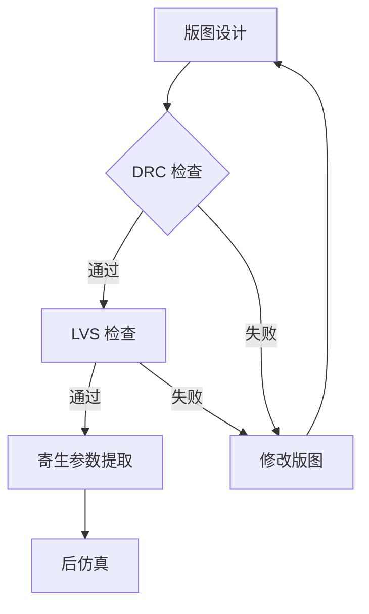
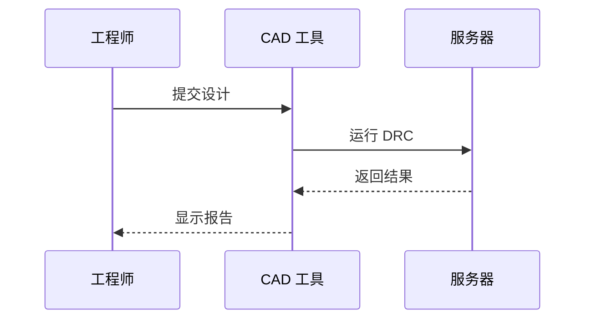
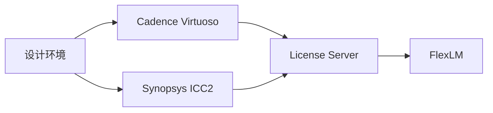

## 流程图

```mermaid
graph TD
    A[版图设计] --> B{DRC 检查}
    B -->|通过| C[LVS 检查]
    B -->|失败| D[修改版图]
    D --> A
    C -->|通过| E[寄生参数提取]
    C -->|失败| D
    E --> F[后仿真]
```

## 序列图

```mermaid
sequenceDiagram
    participant E as 工程师
    participant C as CAD 工具
    participant S as 服务器

    E->>C: 提交设计
    C->>S: 运行 DRC
    S-->>C: 返回结果
    C-->>E: 显示报告
```

## 架构图

```mermaid
graph LR
    A[设计环境] --> B[Cadence Virtuoso]
    A --> C[Synopsys ICC2]
    B --> D[License Server]
    C --> D
    D --> E[FlexLM]
```
